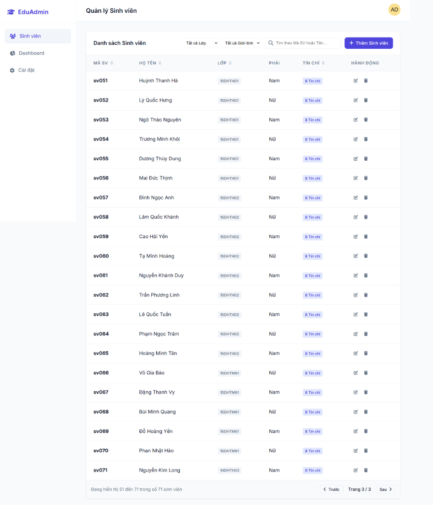
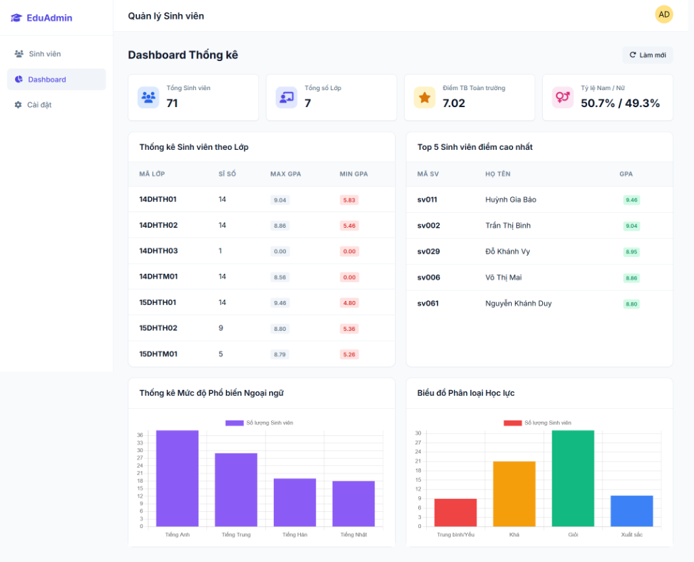

# 🎓 Ứng Dụng Quản Lý Sinh Viên - MongoDB & .NET Core API

Dự án này là một hệ thống quản lý sinh viên được xây dựng hoàn toàn bằng **C# .NET Core 8.0 Web API** kết hợp cơ sở dữ liệu NoSQL **MongoDB**. Giao diện Frontend được viết bằng HTML, CSS (Vanilla) và JavaScript, giao tiếp trực tiếp với Backend qua RESTful API.

## 🚀 Tính năng nổi bật
* **Kiến trúc Singleton**: Quản lý kết nối `MongoClient` duy nhất trong suốt vòng đời ứng dụng.
* **CRUD Hoàn chỉnh**: Thêm, đọc (phân trang/sắp xếp/tìm kiếm tuyệt đối & tương đối), cập nhật, xóa sinh viên.
* **Mảng động (Dynamic Arrays)**: Thêm không giới hạn Môn học và Ngoại ngữ sử dụng các toán tử `$push`.
* **Cập nhật Positional (`$`)**: Cập nhật điểm của một môn học cụ thể trong mảng.
* **Dashboard Thống kê Aggregation**: Sử dụng `$facet`, `$bucket`, `$unwind`, `$group` để đếm KPI, vẽ biểu đồ ngôn ngữ và phân loại học lực Top sinh viên.
* **Auto Indexing & Seeding**: Tự động tạo `Unique Index` (Mã SV) và `Compound Index` (Mã Lớp + Họ Tên) cùng với việc nhồi sẵn (seed) 20 dữ liệu mẫu ngay lần chạy đầu tiên.

## 📸 Giao diện Ứng dụng
## 📸 Giao diện Ứng dụng
### 1. Quản lý Sinh viên

### 2. Dashboard Thống Kê

---

## 🛠 Hướng dẫn Cài đặt & Chạy ứng dụng

### 1. Yêu cầu hệ thống
* .NET SDK 8.0 (hoặc bản tương thích .NET Core API).
* MongoDB Server (Bản Local 5.0+ hoặc MongoDB Atlas).
* Trình duyệt web (Chrome, Edge, Firefox...).

### 2. Cấu hình Chuỗi kết nối (Connection String)
Ứng dụng sử dụng `dotnet user-secrets` để bảo mật chuỗi kết nối. Bạn cần trỏ ứng dụng tới database MongoDB của mình (Local hoặc Atlas).

Mở Terminal (Command Prompt/PowerShell) tại thư mục `StudentManagement` (nơi chứa file `.csproj`) và chạy lệnh sau:
```bash
# Khởi tạo user-secrets (nếu chưa có)
dotnet user-secrets init

# Cấu hình Connection String
dotnet user-secrets set "MongoDB:ConnectionString" "mongodb://localhost:27017"
# (Thay thế URL trên bằng URL MongoDB Atlas của bạn nếu dùng Cloud)

# Cấu hình tên Database
dotnet user-secrets set "MongoDB:DatabaseName" "qlsinhvien_db"
```
*(Lưu ý: Nếu không dùng `user-secrets`, bạn có thể thêm trực tiếp block `"MongoDB"` vào file `appsettings.json` ở thư mục gốc).*

### 3. Cài đặt Dependencies (Thư viện)
Ứng dụng sử dụng thư viện Driver chính thức của MongoDB. Để cài đặt/khôi phục thư viện, chạy lệnh:
```bash
dotnet restore
```
Gói thư viện chính được sử dụng:
* `MongoDB.Driver`

### 4. Khởi chạy Ứng dụng
Sau khi cấu hình xong, chạy lệnh sau để khởi động Backend Server:
```bash
dotnet run
```
*   Ứng dụng sẽ chạy tại địa chỉ: `http://localhost:5195` (hoặc cổng tương tự được báo trong console).
*   Mở trình duyệt và truy cập vào địa chỉ trên (ví dụ: `http://localhost:5195/index.html`) để sử dụng toàn bộ giao diện quản trị trực quan.

> **💡 Lưu ý về Dữ liệu mẫu (Seed Data)**: Khi chạy lệnh `dotnet run` lần đầu tiên, hệ thống sẽ tự động quét cơ sở dữ liệu. Nếu chưa có dữ liệu, nó sẽ tự động chạy file `DatabaseSeeder.cs`, tạo 2 Indexes tối ưu hóa và bơm 20 sinh viên mẫu vào CSDL để bạn có thể xem Dashboard và danh sách ngay lập tức!
